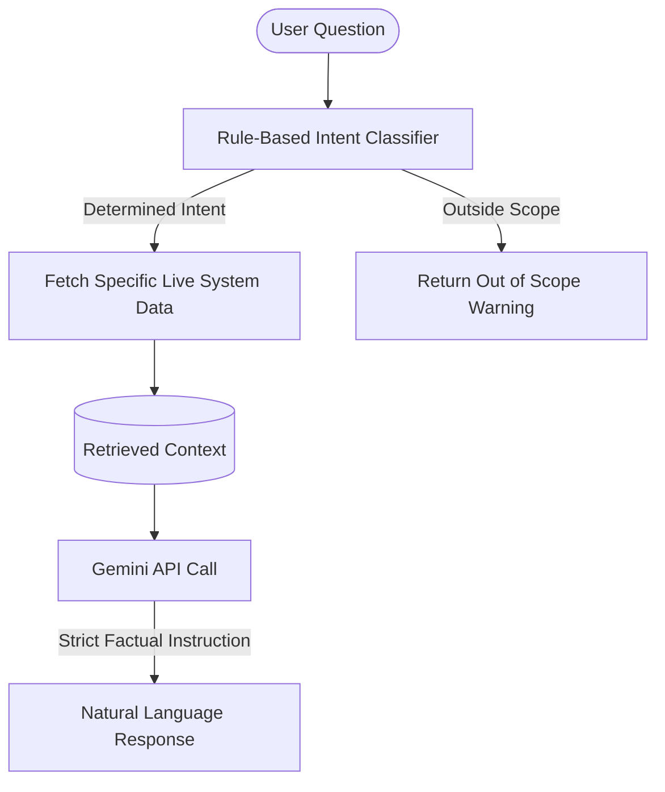

# Data-Aware AI Assistant Documentation

This document describes the design, routing mechanisms, and configuration guidelines for the Data-Aware AI Assistant integrated into the Social Threat Analyzer.

## Architecture & Grounding Protocol

Unlike open-ended conversational agents that might hallucinate facts or execute arbitrary system functions, this assistant employs a strict **deterministic grounding architecture**:



1. **Deterministic Intent Classifier (Keyword / Regex Matching)**:
   * The analyst's question is evaluated by a rule-based matching system inside [query_router.py](file:///c:/Users/kunjp/OneDrive/Desktop/Experiments/social-threat-analyzer/backend/assistant/query_router.py) (NOT the LLM).
   * It maps inputs to one of five supported intents:
     - `system_status`: Verifies overall pipeline statistics, Neo4j, and OCR availability.
     - `coordination_summary`: Compiles metadata from detected bot amplification clusters.
     - `specific_cluster`: Performs details lookup for a single coordination campaign (e.g., `CLUSTER_01`).
     - `trends_summary`: Aggregates temporal activity spikes and high-frequency keywords.
     - `incident_count`: Counts/lists critical incidents, extracting geographical (city) and threat category filters.
2. **Context-Only LLM Synthesis**:
   * If the intent matches, the router fetches the real system data from backend database state.
   * This real data, along with the question, is sent to the Gemini API (`gemini-1.5-flash`).
   * The model is instructed under strict system instructions to phrase a natural-language response using **ONLY** the provided context. If no facts are given or the result is empty, it states so directly rather than extrapolating.
3. **Outside Scope Guardrail**:
   * Any question that fails to match the rule-based intent maps is rejected instantly with a helpful guidance message, blocking external reasoning handoffs.

---

## Configuration & Known Constraints

### Environment Variables
Configure the following variable in your local `.env` file:
```bash
# Google Gemini API Key (obtained from Google AI Studio)
GEMINI_API_KEY=AIzaSy...
```

### Graceful Fallback Mode
If the `GEMINI_API_KEY` is missing or the external API call fails (due to network or rate limits), the backend will automatically fallback gracefully without crashing:
- It returns the matched intent classification.
- It provides the raw, parsed database JSON context in the `data_used` field.
- The UI will display a notification message alongside the raw data backing the query.

### Free-Tier Rate Limits
Since this assistant leverages the free-tier Gemini API, it is subject to standard caps:
* **15 Requests Per Minute (RPM)**
* **1,500 Requests Per Day (RPD)**

Avoid querying the assistant continuously in high-throughput automated loops. If rate-limit caps are hit, the system will output the JSON context raw to the client dashboard.
